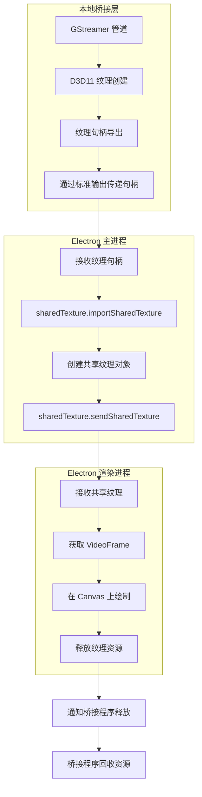

# Electron SharedTexture + GStreamer 演示

## 项目概述

这是一个基于 Electron 40 的 `sharedTexture` API 演示项目，展示了如何通过 GStreamer D3D11 纹理实现高效的视频帧共享。该项目演示了从 GStreamer 管道到 Electron 渲染进程的零拷贝纹理传输，为实时视频应用提供了高效的解决方案。

## 技术架构

### 核心组件

1. **主进程 (main.js)**
   - Electron 主进程，负责创建窗口和管理 GStreamer 桥接程序
   - 处理从桥接程序接收的纹理句柄
   - 使用 `sharedTexture.importSharedTexture()` 导入纹理
   - 通过 `sharedTexture.sendSharedTexture()` 将纹理发送到渲染进程

2. **渲染进程 (renderer.js)**
   - 接收共享纹理并在 Canvas 上显示
   - 处理纹理帧的绘制和释放
   - 提供实时状态信息和调试数据

3. **本地桥接程序 (gst_texture_bridge.cpp)**
   - 使用 GStreamer 处理视频流
   - 管理 D3D11 纹理的创建和共享
   - 将纹理句柄传递给主进程
   - 处理纹理的生命周期管理

4. **前端界面 (index.html)**
   - 显示视频流
   - 提供状态信息和调试数据面板

### 工作流程



## 关键技术点

### 1. 纹理共享机制

- **零拷贝传输**：通过 D3D11 纹理共享，避免了视频帧数据的多次拷贝
- **句柄传递**：使用 Windows NT 句柄在进程间传递纹理引用
- **资源管理**：实现了完整的纹理生命周期管理，确保资源正确释放

### 2. GStreamer 集成

- **管道配置**：使用 `videotestsrc` 生成测试视频流
- **D3D11 内存**：利用 GStreamer 的 `GstD3D11Memory` 实现硬件加速
- **应用接收器**：通过 `appsink` 接收视频帧并处理

### 3. Electron SharedTexture API

- **纹理导入**：使用 `sharedTexture.importSharedTexture()` 导入外部纹理
- **纹理发送**：通过 `sharedTexture.sendSharedTexture()` 发送纹理到渲染进程
- **纹理接收**：在渲染进程中设置 `sharedTexture.setSharedTextureReceiver()` 处理接收到的纹理

## 项目结构

```
├── native/                  # 本地桥接程序
│   ├── src/
│   │   └── gst_texture_bridge.cpp  # GStreamer 桥接实现
│   └── CMakeLists.txt       # CMake 配置文件
├── scripts/
│   └── build-native.ps1     # 构建本地桥接程序的脚本
├── index.html               # 前端界面
├── main.js                  # Electron 主进程
├── renderer.js              # Electron 渲染进程
├── package.json             # 项目配置和依赖
└── README.md                # 项目说明
```

## 运行要求

- **Electron**：40.8.0 或更高版本
- **GStreamer**：安装并配置在系统路径中
- **MSYS2**：用于构建本地桥接程序
- **Windows**：目前仅支持 Windows 平台（D3D11 依赖）

## 构建和运行

### 1. 构建本地桥接程序

```powershell
npm run build:native
```

### 2. 启动应用

```powershell
npm start
```

## 技术细节

### 纹理共享流程

1. **GStreamer 管道创建**：桥接程序启动 GStreamer 管道，生成视频流
2. **D3D11 纹理处理**：将视频帧转换为 D3D11 纹理
3. **句柄导出**：创建共享句柄并传递给 Electron 主进程
4. **纹理导入**：主进程使用 `sharedTexture.importSharedTexture()` 导入纹理
5. **纹理发送**：主进程将纹理发送到渲染进程
6. **纹理接收**：渲染进程接收并显示纹理
7. **资源释放**：渲染进程使用完毕后释放纹理，通知桥接程序回收资源

### 性能优化

- **纹理池**：实现了纹理池机制，避免频繁创建和销毁纹理
- **帧队列**：使用帧队列管理，确保平滑的视频播放
- **错误处理**：完善的错误处理机制，确保系统稳定性
- **资源跟踪**：详细的资源使用跟踪，便于调试和优化

## 应用场景

- **实时视频应用**：如视频会议、直播等
- **游戏流媒体**：将游戏画面高效传输到 Electron 应用
- **视频编辑**：实时预览视频编辑效果
- **监控系统**：显示多个监控摄像头的画面

## 未来扩展

- **跨平台支持**：添加对 Linux 和 macOS 的支持
- **更多视频源**：支持从摄像头、网络流等多种视频源获取视频
- **高级功能**：添加视频处理、滤镜等功能
- **性能优化**：进一步优化纹理共享机制，提高性能

## 总结

该演示项目展示了 Electron 40 新的 `sharedTexture` API 与 GStreamer D3D11 纹理的结合使用，实现了高效的视频帧共享。通过零拷贝的纹理传输机制，大大提高了视频处理的性能，为实时视频应用提供了新的解决方案。

该项目不仅是一个技术演示，也是学习 Electron 新 API 和 GStreamer 集成的优秀示例，为开发者提供了参考和借鉴。